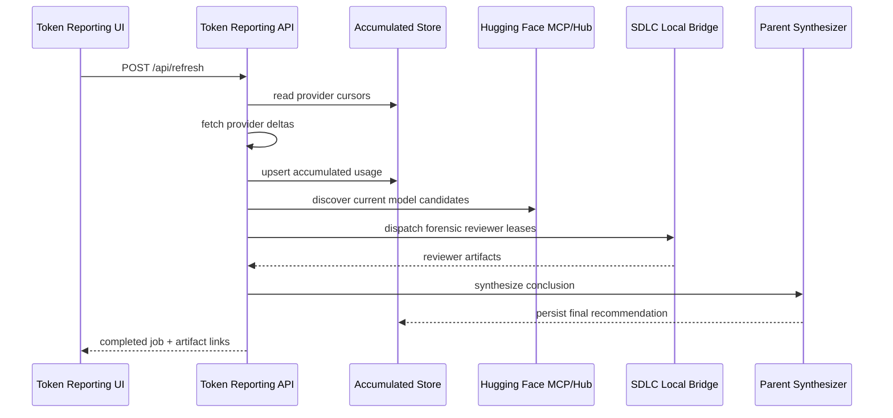

# Token Reporting Suite Publishing and Multi-Model Forensic Extension Plan

## Summary

Token Reporting should become the suite's canonical token, spend, forecast, and
local-model recommendation extension. It must run independently for users who
only want this dashboard, while also plugging into the broader KDTIX
`projectit.ai` suite through the same extension, plugin, MCP, and bridge
contracts used by `sdlc-automated`.

The near-term publication path remains hybrid:

- local Docker for stateful provider refresh, credentials, and local bridge
  access
- Cloudflare Tunnel and the `dev.projectit.ai/tools/*` subpath pattern for MVP
  previews
- a later Cloudflare-native deployment lane for the MVP suite
- post-MVP independent publishing lanes for local Docker, Cloudflare, AWS,
  Azure, and GCP

This plan deliberately separates the open extension/API contract from any
proprietary orchestration runtime. Token Reporting supplies normalized budget
and recommendation artifacts. `sdlc-automated` may consume those artifacts
through its extension registry and bridge runtime without importing this app's
internal UI code.

Shared coordination journal: `kdtix-open/agent-project-queue#1244`.

## Discovery Notes

### Existing Token Reporting state

- The app is a Vite/React static dashboard plus Node/TypeScript refresh scripts.
- Provider refresh scripts currently write local JSON under `public/data/**`.
- Recent work added accumulated metadata files so refreshes can preserve
  history and resume from the provider's last known record where the upstream
  API supports it.
- The export UI can already generate PDF, DOCX, XLSX, CSV, JSON, YAML, and
  database SQL artifacts.
- Baseline before this planning change: `npm test -- --run` passed 15 files and
  104 tests on 2026-06-06.

### Existing SDLC suite state

- `sdlc-automated/docs/plans/Plan-of-Plans.md` identifies the local bridge,
  Platform Budgets, and Extensibility MCP/Skills/Plugins plans as the relevant
  integration backbone.
- `Platform_Budgets_and_Extension_Runtime.md` already names Token Reporting as
  a canonical external MIT extension and asks the orchestrator to consume its
  provider adapters instead of rebuilding provider usage telemetry inline.
- `License_Boundary_Catalog.md` classifies orchestration, bridge runtime,
  hosted wrappers, budgets, and product intelligence as BUSL-1.1, while public
  connector interfaces, generic utilities, public schemas, public docs, and
  community extension surfaces are MIT.
- The bridge currently runs provider CLIs (`claude`, `codex`, `copilot`,
  `cursor`) on the operator host, with isolated provider runtime homes and a
  hosted work-claim queue. The current checkout reports package version
  `0.1.0`; this plan treats bridge `0.1.8+` as the compatibility target named
  by the operator and defers exact version alignment to the bridge workstream.

### Current Cloudflare publication notes

- The existing `sdlc-automated` public preview pattern is Docker plus Caddy plus
  Cloudflare Tunnel at a subpath such as `/tools/repo-orchestrator`.
- Current Cloudflare Workers documentation recommends Workers Static Assets for
  new static, SPA, and full-stack app deployments.
- Cloudflare Cron Triggers fit scheduled provider refreshes, and Cloudflare
  Workflows fit long-running or multi-step refresh and forensic jobs.
- Cloudflare Tunnel remains appropriate for the current hybrid local-Docker to
  Cloudflare preview path because it maps public hostnames to local services
  behind `cloudflared`.

## Scope

### Must

- Define a Token Reporting extension manifest that can be consumed by the
  shared KDTIX suite extension registry.
- Define stable API contracts for refresh, accumulated provider telemetry,
  export artifacts, and local-model forensic recommendations.
- Keep provider credentials server-side or local-bridge-side only. Browser code
  must never hold provider secrets or MCP credentials.
- Support the current hybrid local Docker to Cloudflare Tunnel publishing lane.
- Preserve an independent Token Reporting publishing lane so this app can be
  deployed without the full KDTIX suite.
- Define a multi-model forensic layer that can use the local bridge rather than
  creating a separate provider CLI execution system.
- Keep public extension schemas and adapters in an open license zone and avoid
  imports from proprietary orchestration code.

### Should

- Add a Cloudflare-native MVP lane using Workers Static Assets, D1 or R2,
  Cron Triggers, Workflows or Queues, and AI Gateway where appropriate.
- Add cloud-provider deployment stubs for AWS, Azure, and GCP without requiring
  all of them to ship in the first MVP.
- Persist each forensic reviewer report separately before parent synthesis.
- Record provenance for Hugging Face model candidates, provider usage snapshots,
  model reviewer outputs, and final recommendations.
- Make refresh self-healing and idempotent by storing job state and resuming
  from each provider's last known record.

### Could

- Publish extension packages as both MIT and Apache-2.0 compatible artifacts if
  owner/legal confirms the dual permissive boundary.
- Add a suite-level connector catalog page that shows which KDTIX apps consume
  Token Reporting APIs.
- Add optional MCP tools for direct `get_budget_status`, `get_forecast`, and
  `get_local_model_recommendation` calls.

### Won't This Time

- Rebuild `sdlc-automated` bridge execution in this repository.
- Move provider credentials into the browser.
- Require AWS, Azure, or GCP deployment before the Cloudflare MVP lane exists.
- Make the full KDTIX suite a dependency for a standalone Token Reporting
  deployment.

## Architecture Direction

### Runtime Lanes

| Lane | Use | Deployment shape | Status |
|---|---|---|---|
| Local Docker | Operator/dev, private credentials, historical refresh | Node service + Vite build + local storage or SQLite/Postgres | Must for MVP |
| Hybrid Cloudflare | Public preview while stateful work runs locally | Docker app behind Caddy, exposed by Cloudflare Tunnel under `dev.projectit.ai/tools/token-reporting` | Must for MVP |
| Cloudflare-native | MVP suite publication | Worker with Static Assets, D1/R2, Cron Trigger, Workflow/Queue, AI Gateway | Should after hybrid MVP |
| AWS | Client deployable option | Container or serverless API + object/SQL storage + scheduled jobs | Post-MVP lane |
| Azure | Client deployable option and Azure AI Foundry path | Container Apps/App Service or Functions + Storage/SQL + Foundry integration | Post-MVP lane |
| GCP | Client deployable option | Cloud Run or Functions + Cloud Storage/SQL + Scheduler | Post-MVP lane |

Each lane must publish the same logical API surface. Environment-specific
adapters supply storage, secrets, queueing, scheduled jobs, and AI-provider
execution.

### Proposed API Surface

Static v0.1 is now represented in code by `src/lib/integrationContractStub.ts`
and can be served locally with:

```bash
npm run integration:stub
```

Default local URL: `http://127.0.0.1:8787`. This stub is intentionally
deterministic so `sdlc-automated` can write Red/Green integration tests without
waiting for dynamic provider refresh or live bridge forensics.

Budget/health v0.1 adds:

- `GET /api/budgets`
- `GET /api/providers/:providerId/budget-status`

These endpoints are static and redacted. They expose dispatch-guard evidence
for proactive provider exhaustion prediction without exposing provider admin
tokens, signed URLs, raw user identifiers, or raw admin snapshots.

Dynamic v0.1 is now represented in code by
`src/lib/integrationContractDynamic.ts` and can be served locally with:

```bash
npm run integration:api
```

Default local URL: `http://127.0.0.1:8788`. The dynamic service reads
accumulated provider snapshots from `public/data/**/accumulated-metadata.json`
first, falls back to the latest provider snapshot, and then falls back to seed
data when no local file is available. This keeps the contract self-healing for
local development while preserving the provider-specific accumulated history
needed for forecasting.

Budget limits may be injected for local smoke tests or SDLCA integration tests:

```bash
TOKEN_REPORTING_PROVIDER_BUDGET_LIMITS_JSON='{"codex":{"budgetKind":"tokens_per_window","limit":700000000}}' \
  npm run integration:api
```

Dynamic budget/health fields intentionally remain redacted and provenance-bound:

- `providerId`, `providerLabel`, `scopeId`, `scopeLabel`
- `budgetKind`, `used`, `limit`, `remaining`, `resetAt`
- `threshold`, `dispatchGuard`, `estimatedDispatchesRemaining`
- `confidence`, `forecastWindowMinutes`, `provenance`

The first dynamic slice is ready for local accumulated-data contract
consumption by `sdlc-automated`. It is not yet the final production admin-budget
service: provider admin-token collection, tenant-scoped budget persistence, and
scheduled dynamic refresh remain part of the accumulated refresh service
initiative.

Dynamic refresh v0.1 now wires `POST /api/refresh` to a guarded provider script
executor in `src/lib/dynamicRefreshExecutor.ts`. The executor maps provider ids
to the existing report scripts, passes historical mode through
`TOKEN_REPORTING_FETCH_MODE=historical`, and reports missing admin environment
variables as provider-specific degraded results rather than crashing the whole
job. Refresh jobs are persisted by `src/lib/refreshJobStore.ts` and can be
polled with `GET /api/refresh/:jobId`.

Because refresh mutates local accumulated data, the dynamic API honors the
repository read-only guard:

```bash
TOKEN_REPORTING_READ_ONLY=1 npm run integration:api
```

When read-only mode is enabled, `POST /api/refresh` returns HTTP 403 with a
`read_only` error and does not execute provider scripts. This is the recommended
mode for SDLCA/Auditor consumer tests that only need contract, usage, budget,
and guard reads.

The local API defaults the refresh job store to
`public/data/integration/refresh-jobs.json`. Use
`TOKEN_REPORTING_REFRESH_JOB_STORE_PATH` to isolate tests or run multiple local
instances without sharing job state.

The dashboard refresh button now calls the dynamic integration API before
reloading local snapshots. It sends incremental refresh requests with
`includeHuggingFaceRefresh=true` and `includeForensicModelProfiles=true`, then
reloads accumulated provider snapshots from `/data/**`. In read-only mode, the
UI displays the API guard message and still reloads the currently available
snapshots.

When `includeHuggingFaceRefresh=true`, dynamic refresh v0.1 runs
`npm run report:huggingface-candidates` before provider scripts. The candidate
refresh reads the Hugging Face Hub model API for the current local-model
shortlist, writes `public/data/huggingface/local-model-candidates.json`, and can
be redirected with `TOKEN_REPORTING_HF_CANDIDATES_PATH` for tests or isolated
local runs. The dashboard loads that candidate set and enriches the On-prem
model profiles with Hub provenance such as downloads, likes, last modified
timestamp, license, and model-card URL while keeping curated local profile
fields intact when Hub metadata is missing.

Dynamic forensic runs v0.1 are also handled by the local integration API:

- `POST /api/local-model-profiles/forensic-runs`
- `GET /api/local-model-profiles/latest`

The POST endpoint creates a persisted run record with a deterministic
`dynamic-forensic-*` id, evidence packet provenance, queued reviewer artifact
URIs, the requested Hugging Face candidate set id, and the provider usage
snapshot ids available at run creation time. Because SDLCA bridge forensic
execution is not wired yet, these runs currently return `status: degraded` and
`degradedReason: bridge_forensic_executor_not_configured`. This is deliberate:
consumers can test real run ids, persistence, latest lookup, and boundary
semantics without pretending reviewer synthesis exists.

The local API defaults the forensic run store to
`public/data/integration/forensic-runs.json`. Use
`TOKEN_REPORTING_FORENSIC_RUN_STORE_PATH` to isolate tests or run multiple local
instances without sharing forensic run state. The endpoint honors
`TOKEN_REPORTING_READ_ONLY=1` and returns HTTP 403 before any run is written.

Bridge-backed forensic execution v0.1 is implemented in
`src/lib/sdlcaBridgeForensics.ts`. It uses the accepted SDLCA additive bridge
path:

- `GET /providers` to discover providers with `forensicCapabilities`
- `POST /execute` with `executionKind: "forensic"` and `providerRole:
  "reviewer"`
- returned artifacts must match `artifactSchemaVersion:
  "sdlca.bridge.forensic.v0"`

Enable it in the local dynamic API with:

```bash
TOKEN_REPORTING_SDLCA_BRIDGE_URL=http://127.0.0.1:<bridge-port> \
TOKEN_REPORTING_SDLCA_BRIDGE_TOKEN=<bridge-token> \
TOKEN_REPORTING_SDLCA_BRIDGE_WORKING_DIRECTORY=/absolute/path/to/repo \
npm run integration:api
```

Optional:

```bash
TOKEN_REPORTING_SDLCA_BRIDGE_TIMEOUT_MS=120000
```

Credential ownership remains split by responsibility:

- Token Reporting owns provider Admin/API credentials used for usage refresh
  and budget/health telemetry.
- SDLCA local bridge owns provider CLI credentials used for forensic reviewer
  execution.
- Token Reporting receives only the SDLCA bridge URL/token needed to call the
  accepted local bridge surface; it must not receive provider CLI forensic
  tokens.

Reviewer model routing is intentionally conservative for the first bridge
slice: Sonnet/Opus route to SDLCA `claude`, GPT/Grok/Gemini/Kimi fall back to
`codex`, Composer routes to `cursor`, and Copilot routes to `copilot`. Providers
must advertise reviewer forensic capability before Token Reporting dispatches
to them. Provider Admin API snapshots and credentials are never sent to the
bridge; only the redacted Token Reporting evidence packet and identifiers are
included in the prompt.

When reviewer artifacts complete, Token Reporting persists the returned
redacted bridge artifacts on the forensic run record and creates a deterministic
parent synthesis summary from the completed artifacts. This is enough for local
dynamic E2E testing while preserving the option to replace deterministic parent
synthesis with a bridge-backed parent agent in a later slice.

`POST /api/refresh` now honors `includeForensicModelProfiles=true` by creating
the same persisted forensic run after provider refresh execution. The dashboard
already sends this flag from the Refresh Report button, so a bridge-configured
dynamic API can refresh provider data, optionally refresh Hugging Face
candidates, dispatch bridge-backed forensic reviewers, and persist the latest
local-model synthesis from a single UI refresh flow. If provider refresh
degrades but forensic execution succeeds, the refresh job records both states:
the overall job is degraded while `forensicRun.status` can still be completed.

```ts
interface TokenReportingExtensionManifest {
  id: "kdtix.token-reporting";
  version: string;
  licenseZone: "MIT" | "Apache-2.0" | "MIT OR Apache-2.0";
  basePath: "/tools/token-reporting";
  capabilities: Array<
    | "provider-usage-refresh"
    | "historical-usage-accumulation"
    | "report-export"
    | "budget-status"
    | "forecast"
    | "local-model-forensics"
  >;
  api: {
    refresh: "POST /api/refresh";
    refreshStatus: "GET /api/refresh/:jobId";
    providers: "GET /api/providers/:providerId/usage";
    budgets: "GET /api/budgets";
    budgetStatus: "GET /api/providers/:providerId/budget-status";
    exports: "POST /api/exports";
    modelProfiles: "GET /api/local-model-profiles/latest";
    forensicRun: "POST /api/local-model-profiles/forensic-runs";
  };
}
```

```ts
interface RefreshRequest {
  mode: "historical" | "incremental";
  providers?: string[];
  includeHuggingFaceRefresh?: boolean;
  includeForensicModelProfiles?: boolean;
}

interface RefreshResult {
  jobId: string;
  status: "queued" | "running" | "completed" | "failed" | "degraded";
  providerResults: Array<{
    providerId: string;
    startedAt: string;
    completedAt?: string;
    accumulatedThrough?: string;
    degradedReason?: string;
  }>;
}
```

```ts
interface LocalModelForensicRun {
  runId: string;
  usageSnapshotId: string;
  huggingFaceCandidateSetId: string;
  reviewerModels: Array<
    "sonnet" | "opus" | "gpt" | "grok" | "composer" | "gemini" | "kimi"
  >;
  reviewerArtifacts: Array<{
    reviewerModel: string;
    artifactUri: string;
    status: "queued" | "running" | "completed" | "failed";
  }>;
  parentSynthesisArtifactUri?: string;
}
```

## Refresh and Forensic Flow



Forensic reviewer prompts should be provider-perspective prompts, not generic
"vote" prompts. Each reviewer receives the same evidence packet:

- accumulated provider usage and cost history
- current forecasts
- local session distribution
- Hugging Face candidate metadata and model cards
- deployment constraints supplied by the selected lane
- operator policy such as data-residency, budget, latency, and hardware targets

The parent synthesizer must preserve dissenting findings and confidence levels
rather than flattening everything into a single unsupported recommendation.

## Hugging Face Candidate Discovery

Candidate refresh should use Hugging Face model metadata and tags as the primary
discovery feed. The model card metadata should be retained with the candidate
set so later readers can explain why a model entered or left the on-prem
profile set.

Dynamic candidate refresh v0.1 is implemented by
`src/lib/huggingFaceCandidates.ts` and
`scripts/refresh-huggingface-candidates.ts`, exposed through:

```bash
npm run report:huggingface-candidates
```

The current seed shortlist is:

- `meta-llama/Llama-3.1-8B-Instruct`
- `Qwen/Qwen2.5-Coder-14B-Instruct`
- `Qwen/Qwen2.5-Coder-32B-Instruct`
- `Qwen/Qwen2.5-72B-Instruct`
- `Qwen/Qwen2.5-7B-Instruct-1M`

The implementation is intentionally tolerant: individual Hub failures are
stored as degraded candidate rows instead of failing the entire refresh job.
Repository ids are URL-encoded by path segment so namespace/model slashes are
preserved for the Hub API.

Minimum retained fields:

- model id
- author or organization
- pipeline/task tags
- library name
- license
- base model
- quantization or local-runtime tags when available
- last modified timestamp
- downloads, likes, or trending signals when available
- model card URI
- local runtime notes and hardware requirements when discovered

## License Boundary

Open extension zone:

- extension manifest schema
- normalized provider usage schema
- export request/response schema
- local-model recommendation artifact schema
- thin provider adapters that do not import proprietary orchestration code
- public docs and client deployment templates

Proprietary or suite-internal zone when implemented in `sdlc-automated`:

- bridge execution runtime
- hosted wrapper permission logic
- provider dispatch policy
- Operations Helm policy, PBAC/ABAC, audit gates
- product intelligence and orchestration decisions that live in the SDLC core

Token Reporting should publish open schemas in a way that `sdlc-automated` can
consume without creating an import dependency from MIT/Apache code into
BUSL-1.1 implementation code.

## Backlog Skeleton

### Initiative 1: Extension Contract and API Boundary

- Define `TokenReportingExtensionManifest`.
- Define API schemas for refresh, usage, export, forecast, and forensic runs.
- Add contract tests for schema compatibility.
- Publish a local manifest file that `sdlc-automated` can register.

### Initiative 2: Hybrid Local Docker to Cloudflare MVP

- Add a production Node service that serves the Vite build and API under
  `/tools/token-reporting`.
- Add Dockerfile, compose, and Caddy config aligned with the
  `sdlc-automated` subpath pattern.
- Add a Cloudflare Tunnel profile for preview.
- Add UAT for local Docker and public subpath routing.

### Initiative 3: Accumulated Refresh Service

- Move refresh scripts behind a guarded API/service layer.
- Add provider cursor storage and idempotent job records.
- Add historical bootstrap and incremental resume endpoints.
- Add read-only mode enforcement for all mutating refresh/write operations.

### Initiative 4: Hugging Face Candidate Refresh

- Add a Hugging Face candidate discovery service. `v0.1 complete`
- Persist candidate sets with metadata provenance. `v0.1 complete`
- Trigger candidate refresh from the report refresh UI and scheduled jobs.
  `UI and local API v0.1 complete; scheduled jobs pending`
- Add tests for candidate filtering and provenance retention.

### Initiative 5: Multi-Model Forensic Layer

- Define reviewer evidence packet and output schema.
- Add bridge client integration for forensic reviewer dispatch.
  `direct SDLCA /execute v0.1 complete`
- Persist each reviewer output and parent synthesis output.
  `run/evidence/reviewer artifact records v0.1 complete; bridge artifacts v0.1 complete`
- Add UI states for pending, degraded, and completed recommendations.

### Initiative 6: Independent Publishing Lanes

- Define `deploy/local-docker`.
- Define `deploy/cloudflare`.
- Define `deploy/aws`.
- Define `deploy/azure`.
- Define `deploy/gcp`.
- Keep each lane independently runnable and documented.

## UAT Scenarios

### Scenario 1: Standalone Hybrid Refresh

Goal: Verify Token Reporting can run without the full KDTIX suite.

Prerequisites:

- local Docker available
- provider credentials configured on the server side
- at least one accumulated provider data set exists

Steps:

1. Start the local Docker deployment.
2. Open `/tools/token-reporting`.
3. Click refresh with incremental mode.
4. Download JSON and database exports.

Expected result:

- refresh completes or reports provider-specific degraded status
- accumulated data remains intact
- exports contain the updated snapshot

### Scenario 2: Suite Extension Consumption

Goal: Verify `sdlc-automated` can register Token Reporting without importing UI
internals.

Prerequisites:

- Token Reporting API running
- extension manifest available
- `sdlc-automated` extension registry test harness available

Steps:

1. Register the Token Reporting manifest.
2. Query budget status through the suite extension runtime.
3. Query the latest local-model recommendation.

Expected result:

- suite receives normalized artifacts through public schemas only
- no proprietary bridge or orchestration imports are required by Token Reporting

### Scenario 3: Forensic Recommendation Refresh

Goal: Verify model profile recommendations are regenerated from current usage
and current Hugging Face candidates.

Prerequisites:

- bridge has at least one forensic-capable provider configured
- Hugging Face candidate discovery is enabled
- reviewer model list is configured

Steps:

1. Start a refresh with `includeHuggingFaceRefresh=true`.
2. Enable `includeForensicModelProfiles=true`.
3. Wait for reviewer artifacts and parent synthesis.
4. Open the On-prem model profiles panel.

Expected result:

- each reviewer artifact is stored separately
- failed reviewers are visible without blocking successful reviewers
- parent synthesis cites the evidence packet and reviewer dissent
- UI shows the regenerated recommendation date and source run id

## Verification Gates

- `npm test -- --run`
- `npm run typecheck`
- `npm run lint`
- `npm run build`
- Docker local smoke for `/tools/token-reporting`
- Cloudflare Tunnel preview smoke
- UAT scenarios above

Latest local verification snapshot on 2026-06-07:

- `npm test -- --run`: 23 files, 140 tests passed
- `npm run typecheck`: passed
- `npm run lint`: passed
- `npm run build`: passed
- `npm run report:huggingface-candidates`: wrote 5 live Hub candidates to
  `public/data/huggingface/local-model-candidates.json`
- Writable local forensic smoke on `http://127.0.0.1:8789` returned HTTP 202
  with `status: degraded`, queued reviewer artifacts, and latest-profile lookup.
- Read-only local forensic smoke on `http://127.0.0.1:8788` returned HTTP 403
  before mutation when `TOKEN_REPORTING_READ_ONLY=1`.
- Bridge-backed local smoke with a fake SDLCA bridge on `http://127.0.0.1:4818`
  and Token Reporting on `http://127.0.0.1:8791` returned HTTP 202 with
  `status: completed`, completed Sonnet/Claude and GPT/Codex reviewer
  artifacts, and a persisted latest parent synthesis recommendation.
- Dynamic contract tests verify `includeForensicModelProfiles=true` on
  `POST /api/refresh` creates and persists a forensic run with completed bridge
  artifacts when a bridge executor is configured.
- SDLCA Integration posted no-secrets mocked-bridge E2E pass evidence in
  `agent-project-queue#1244` for both:
  - direct `POST /api/local-model-profiles/forensic-runs`
  - refresh-triggered `POST /api/refresh` with `includeForensicModelProfiles=true`
- Live provider-CLI forensic E2E attempted on 2026-06-08 with an isolated
  current-branch SDLCA bridge and isolated writable Token Reporting API. Current
  branch bridge discovery passed after Token Reporting remediated the real SDLCA
  `GET /providers` response shape (`result`) in addition to the mocked
  `providers` shape. Provider artifact generation remains blocked by local
  provider account state rather than the bridge contract: Codex quota exceeded,
  Claude workspace API limit reached until 2026-07-01 00:00 UTC, Cursor
  Composer usage exhausted, Cursor Composer 2.5 timed out under the 60s smoke
  cap, and Copilot was skipped because budget/health advertised `block`.
  This is not an operator-approval gate unless the run crosses an architecture
  boundary such as new bridge endpoints, credential mixing, raw snapshot
  exposure, or cross-tenant routing.

## Open Questions

- Confirm whether public extension artifacts should be MIT only or dual
  `MIT OR Apache-2.0`.
- Confirm whether Token Reporting should publish a separate npm package for
  schemas and manifest types.
- Confirm whether the parent synthesizer is a Token Reporting responsibility or
  a suite-level agent service responsibility after the local bridge forensic
  path lands.
- Confirm exact bridge version target once the `sdlc-automated` bridge worktree
  reaches the operator's referenced `0.1.8+` line.
